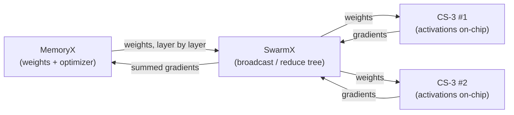

## Cos'è Cerebras WSE

**Cerebras Systems Inc** è un'azienda di semiconduttori nata nel **2015** che produce i **Wafer Scale Engine** (WSE). La particolarità di questi semiconduttori è che sono i più grandi mai creati, misurano quanto un intero wafer di silicio e focalizzati sull'ottimizzazione delle operazioni su matrici per accelerare gli applicativi di intelligenza artificiale e altri calcoli applicativi per Calcolo Scientifico/HPC. 

Proprio come le GPU, i WSE sono acceleratori hardware: non eseguono autonomamente un sistema operativo, ma servono a sollevare la CPU di alcuni carichi di calcolo specifici.

## What's the problem with GPUs

**Memory Wall** - In a traditional GPU has to main types of memory, the on-chip and the off-chip memory. The on-chip memory are (metti il teconologia di memorie) registers, cache, shared memory, these are all really fast memories that are directly in the same silicon die of the compute cores. The problem is that this are quite small, and the Global memory (main memory of the gpu device) are off-chip.

![[Pasted image 20261002112609.png]]
*Fig. 1: memory wall.*[^gholami]

This means that transporting data from off-chip memory to compute cores requires significant time and energy. And in application like LLM token decoding or more in general sparse HPC stencil update, often GPU compute units often sit idle waiting for data to arrive (***memory-bandwidth bound***).

**Scaling beyond the Reticle Limit** - GPUs are manufactured on silicon wafers that are diced into individual dies, and a lithography constraint known as the [[Reticle Limit|reticle limit]] caps the size of a single die at about $858\, mm^{2}$. Flagship GPUs already sit close to this ceiling (the H100 is about $814\ mm^{2}$), so compute power cannot be increased by simply making the chip bigger. Vendors therefore either pack multiple dies in one package, as in the B200, which combines two reticle-sized dies through a die-to-die link, or connect many GPUs together. Both options require data to leave the silicon through slower links: NVLink between GPUs in the same node or rack, PCIe towards the host, and InfiniBand or Ethernet between nodes. At each level bandwidth drops and latency increases, so collective operations such as all-reduce become bottlenecks and scaling efficiency decreases as the cluster grows.

**SIMT Execution and Warp Divergence** - Nelle GPU la concorrenza segue il modello **SIMT** (*Single Instruction, Multiple Threads*), organizzato in blocchi di thread (*Warps* e *Streaming Multiprocessors*). In particolare i threads di un warp condividono il *Program Counter*, quindi devono seguire tutti lo stesso percorso di esecuzione. However, when the code contains conditional control flow (e.g., `if-else`, ecc) where different threads evaluate the condition differently, the hardware experiences **warp divergence**.

## How Cerebras solves this problems 

### Memoria puramente on-chip

L'approccio di Cerebras consiste: durante il calcolo i dati risiedono in una **SRAM distribuita**, fabbricata sullo stesso wafer e con lo stesso processo litografico dei core.
- Ogni PE (processing element) possiede una SRAM locale di **48 KB**, che occupa circa metà dell'area del core.
- Sommando i circa 900.000 core del WSE-3 si ottengono circa **44 GB** di memoria on-chip, distribuiti accanto alle unità di calcolo.
- La banda aggregata dichiarata da Cerebras è di circa **21 PB/s**. È un valore aggregato su tutti i core, quindi non è direttamente confrontabile con i ~3-8 TB/s di un singolo chip GPU.
- L'accesso alla SRAM locale ha una latenza di pochissimi cicli. Accedere al dato di un altro core richiede invece di attraversare la mesh 2D, con una latenza che cresce con il numero di hop.

La capacità è il limite principale: 44 GB non bastano per i parametri di un LLM di grandi dimensioni (Llama 3 70B richiede circa 140 GB in FP16). Per questo, nel training, Cerebras usa il *weight streaming*: i pesi risiedono in una memoria esterna (MemoryX) e vengono inviati al wafer layer per layer, mentre le attivazioni restano on-chip.

|Caratteristica|CPU|GPU|Cerebras WSE-3|
|---|---|---|---|
|**Memoria primaria**|DRAM di sistema (DDR5)|HBM3/HBM3e|SRAM distribuita (+ MemoryX esterna per il weight streaming)|
|**Ubicazione**|Fuori dal socket|Nel package, ma fuori dai core (interposer)|Dentro ogni PE, sullo stesso wafer|
|**Capacità**|100 GB - diversi TB|80 GB (H100), 192 GB (B200)|44 GB on-chip (48 KB/core)|
|**Banda**|~50-100 GB/s (desktop), fino a ~500 GB/s (server)|~3-3,35 TB/s (H100), ~8 TB/s (B200)|~21 PB/s (aggregata)|
|**Latenza**|~70-100 ns|centinaia di ns (memoria globale)|pochissimi cicli (locale)|

A differenza della HBM, che viene prodotta separatamente e collegata tramite interposer o substrato, la SRAM del WSE è integrata nello stesso wafer dei core di calcolo. Questo elimina il bus di memoria esterno per i dati che entrano nei 44 GB, ma sposta il problema: la capacità è limitata e l'accesso a dati remoti passa dalla rete on-wafer.

### 900.000 core su un unico wafer

Per ridurre la necessità di scale-out, Cerebras non aumenta il numero di dispositivi ma la quantità di silicio dentro un solo dispositivo: un wafer da 46.225 mm² (circa 57 volte una H100) con **900.000 core** attivi, collegati da una rete on-wafer.
- Il traffico tra core resta sul silicio: la banda del fabric dichiarata è di **214 Pb/s**. È un valore aggregato, quindi non è confrontabile con il singolo link NVLink (900 GB/s per H100).
- Un modello che entra nei 44 GB di SRAM non attraversa mai NVLink, PCIe o rete: i salti di banda della gerarchia GPU non compaiono.
- Come è stato reso possibile: [[#Cose che sono state dovute risolvere per poterlo fare|reticle stitching e ridondanza]].

### Esecuzione indipendente per core (MIMD spaziale e dataflow)

Per evitare la warp divergence Cerebras abbandona il modello SIMT: ogni PE esegue il proprio flusso di istruzioni (**MIMD**), quindi un branch diverso in un core non blocca i vicini. Il programma è inoltre mappato **nello spazio**: il grafo di calcolo viene disposto sulla griglia e i dati fluiscono da un core all'altro, invece di far ruotare migliaia di thread su pochi SM.

1. **Mesh 2D.** I PE sono disposti in una griglia e ognuno è collegato ai 4 vicini (Nord, Sud, Est, Ovest).
2. **Router per core.** Ogni PE ha un piccolo router hardware che inoltra messaggi (*wavelet*) ai vicini in pochissimi cicli, senza passare dal software né dalla memoria. I percorsi sono configurati in compilazione.
3. **Esecuzione guidata dai dati (dataflow).** Un core non cicla in attesa: resta inattivo finché non arriva un wavelet. L'arrivo attiva il task corrispondente, e il risultato viene inoltrato lungo la griglia al PE successivo.

> [!warning] Il costo di questa scelta
> La divergenza non sparisce, si trasforma in **load imbalance**: se un core è più lento degli altri, frena tutta la pipeline a valle.

---
## Cose che sono state dovute risolvere per poterlo fare

### Overcoming the Reticle Limit

The [[Reticle Limit|reticle limit]] caps any single exposure at about $858\ \text{mm}^2$, so a wafer-sized chip cannot be printed in one go. Instead, TSMC prints **84 identical dies** (a 12 × 7 grid), each exposed as one reticle field of roughly $550\ \text{mm}^2$ ($46{,}225 / 84$), exactly as it would for 84 ordinary chips. The difference is what happens next: rather than sawing the 300 mm wafer apart, Cerebras adds extra lithography steps that pattern wires across the **scribe lines**, the gaps between dies that normally hold test structures and are cut through.

* More than a million wires, each shorter than 1 mm and built in the upper metal layers, cross the die boundaries in every direction.
* The protocol on these wires includes redundancy against defective wires.
* Cores on adjacent dies communicate with the same bandwidth as cores on the same die, with low latency and power, because no package boundary is crossed.
* From the software's perspective the 84 dies do not exist: the wafer behaves as a single chip with one continuous 2D mesh.

### Yield Economics and Dicing

Chips are normally printed by the hundreds on a 300 mm wafer and then diced, because manufacturing defects are unavoidable and silicon defect density limits how large a die can be before yield collapses. A common first-order model is:

$$Y \approx e^{-D \cdot A}$$

where $D$ is the defect density per unit area and $A$ is the area of the chip. If a chip is massive, a single microscopic defect can render the whole chip useless, so manufacturers keep dies small: a localized defect then destroys only one die out of hundreds on the wafer.

> [!example] Why a wafer-sized chip looks impossible
> Assuming $D \approx 0.001\ \text{mm}^{-2}$, the WSE-3 area of 46,225 mm² would contain on average $A \cdot D \approx 46$ defects. Under the model above, the probability of a defect-free wafer is $e^{-46} \approx 10^{-20}$.
> A conventional design that discards any defective chip cannot work at this scale.

### Solving Yield Economics via Native Hardware Redundancy

Cerebras does not try to avoid defects: it assumes they will happen and makes each one cheap. The key quantity is not the total area but the **area lost per defect**.

* **Tiny cores.** Each WSE-3 core is about 0.05 $mm^{2}$, versus $\sim 6 mm^{2}$ for an H100 SM. A defect disables only the core it lands on, so far less silicon is lost per defect (about two orders of magnitude less).
* **Spare cores.** The wafer contains ~970,000 physical cores and 900,000 are active, so about 7% of the cores are spares.
* **Reconfigurable mesh.** After post-fabrication testing, defective cores are disabled and the 2D mesh is reconfigured to route around them through redundant communication paths.
* **Not only cores.** Roughly half of the silicon is SRAM, register files and fabric rather than compute logic, so core redundancy alone is not enough: the fabric itself must tolerate faults.

> [!warning] Not 100%
> Even fault-tolerant designs do not reach 100% usable silicon: the WSE-3 ships with part of its cores disabled. The result is that nearly every wafer can be sold as a 900,000-core system, while the specific set of disabled cores differs from wafer to wafer.

### Integrazione wafer-scale (oltre il reticle limit)

Cerebras supera il [[Reticle Limit|reticle limit]] non tagliando il wafer: il WSE-3 è composto da **84 regioni** della dimensione di un reticle field che restano unite sullo stesso wafer. Con TSMC sono stati aggiunti collegamenti metallici che attraversano le **scribe line** (le strisce dove normalmente si taglia), così il wafer si comporta come un unico chip con un'unica rete interna.
- Area di circa **46.225 mm²**, circa 57 volte una H100.
- **900.000 core** collegati da una rete on-wafer (banda dichiarata: **214 Pb/s**), quindi la comunicazione tra core non passa da NVLink, PCIe o rete.
- Su un'area così grande i difetti sono inevitabili: il chip include **core ridondanti** e il routing aggira quelli difettosi.
- **Limite:** i modelli che superano i 44 GB richiedono comunque più sistemi, ma il punto in cui i dati escono dal silicio è molto più in alto nella gerarchia.

### Power Delivery, Cooling and Thermal Expansion

Once the wafer works as a single chip, it still has to be powered, cooled and mounted, and no standard package can do any of the three at this size. Cerebras lists packaging, cooling and thermal expansion among its main hurdles, together with cross-die connectivity and yield.

![[Pasted image 20261001195131.png|700]]

#### Power delivery

* The CS-3 draws about **23 kW** from a single wafer, which means a current of more than **20,000 A** at very low voltage.
* The chip is too large to bring power in horizontally from the edges, so power is delivered **vertically** (the "Z dimension"): hundreds of voltage regulator modules (VRMs) are distributed across the wafer surface and feed current perpendicular to the silicon.
* Each reticle region has independent power domains and redundancy in its power delivery, consistent with the defect-tolerant philosophy of the rest of the design.

#### Cooling

* Air cooling is not viable for this heat load over such a large surface.
* Cerebras uses **water cooling** through a custom copper **cold plate** with a grid of tiny fins. Water is pushed down onto the wafer's back side rather than flowed across it, again using the Z dimension.
* In the first-generation system, the water loop was closed and the coolant was chilled through a heat exchanger by redundant, hot-swappable pumps and fans.

#### Thermal expansion mismatch

* Silicon and the fiberglass PCB expand at different rates as they heat up (different **coefficients of thermal expansion**, CTE). On a chip this large, the difference in displacement creates enough mechanical stress to crack the wafer.
* Standard attachment techniques are not usable. Cerebras developed a **custom connector**, made of a new material, that sits between wafer and PCB and absorbs the relative movement while keeping every electrical contact intact.
* The result is a four-layer "sandwich": **cold plate → wafer → connector → PCB**.

> [!warning] Cost of the solution
> None of this exists as an off-the-shelf package: the product is a complete, purpose-built system (the CS-3 is a 15U unit), not a card that plugs into a standard server.

## Remaining Limits

Wafer-scale integration removes the chip boundary, but it does not remove every constraint. Three limits remain.

### Limited Capacity and Weight Streaming

The 44 GB of on-chip SRAM cannot hold the parameters of a large model, and training needs even more (gradients, optimizer state). Cerebras' answer for training is **weight streaming**:

* Weights live off-chip in **MemoryX**. One layer at a time is streamed to the wafer, which keeps the **activations** on-chip.
* In the backward pass, gradients are streamed back to MemoryX, where the weight update takes place.
* Since weights never reside on the chip, model size is no longer bounded by on-chip memory.
* **SwarmX** connects MemoryX to many systems through a tree-shaped fabric that **broadcasts** weights and **reduces** gradients. Scaling is therefore purely **data parallel**: the systems never communicate with each other, and there is no need for tensor or pipeline parallelism.

> [!warning] The bandwidth problem moves
> Performance now depends on how fast MemoryX can stream weights relative to the compute time of each layer. The claims of "as if on-chip" performance and near-linear scaling come from Cerebras itself.

### Static Mapping and Load Imbalance

* The compiler decides at **compile time** where each part of the computation graph sits on the 2D grid and how data is routed between cores. Routes cannot be reconfigured at runtime.
* The compiler must balance compute across layers, so the divergence problem of GPUs turns into a **load-balancing** problem: when work is pipelined across the mesh, the slowest region sets the pace for everything downstream.
* The whole execution graph must be traced and compiled ahead of time. Dynamic control flow, loops and dynamic shapes are the weak spots; the sweet spot is dense, static tensor graphs.

> [!note] Bottom line
> Wafer-scale trades **generality and ecosystem** for **bandwidth and latency**. It shines on dense, static workloads that fit its memory model, and it is weakest where the work is irregular or dynamic.

[^gholami]: A. Gholami et al., "AI and Memory Wall", IEEE Micro, 2024. arXiv:2403.14123.