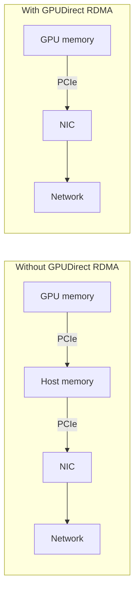

> [!abstract] Summary
> - **RDMA** lets a NIC read or write the memory of a remote machine **without involving the remote CPU or the OS** in the data path.
> - It works through three ideas: **kernel bypass**, **zero-copy** and **CPU offload**.
> - **GPUDirect RDMA** extends this to GPU memory: the NIC accesses VRAM directly over PCIe.
> - It is the standard way to move data between nodes in HPC and AI clusters, but bandwidth still sits well below NVLink.

Related: [[Type of GPUs Interconnections (PCIe and NVLink)|PCIe and NVLink]] · [[Types of RAM Memories]]

---
## The problem with TCP/IP

With a classic socket, every message goes through the kernel:

1. The application calls `send()`, which traps into the **kernel** (system call, context switch).
2. The kernel **copies** the data from the user buffer into a kernel buffer, runs the TCP/IP stack and hands the packets to the NIC.
3. On the receiver, the NIC raises an **interrupt**, the kernel processes the packets and **copies** the data again into the application's buffer.

Each message costs CPU cycles, several memory copies and tens of microseconds. At 400 Gb/s the CPU cannot even keep up with the copying.

---

## The three ideas

| Idea | What it means |
|---|---|
| **Kernel bypass** | The application talks to the NIC directly from user space, through queues mapped in its own address space. No system call per message. |
| **Zero-copy** | The NIC does DMA straight from and to the application's buffers, with no intermediate copies. |
| **CPU offload** | The NIC implements the transport protocol (segmentation, retransmission, reliability) in hardware. |

> [!note] The kernel is still involved in setup
> Creating queues and registering memory goes through the kernel. Only the **data path** bypasses it.

---

## The Verbs programming model

The standard API is *verbs* (`libibverbs`). Its key objects:

| Concept | Description |
|---|---|
| **Memory registration** | The application tells the NIC that a buffer may be accessed remotely. The memory is *pinned* (not swappable) and gets keys: `lkey` (local) and `rkey` (remote), which act as access tokens. |
| **Queue Pair (QP)** | A send queue and a receive queue. The application posts *work requests* to them. |
| **Completion Queue (CQ)** | The NIC posts a completion entry when a request finishes. The application **polls** it, with no interrupt needed. |

### Two kinds of operations

| | Two-sided | One-sided |
|---|---|---|
| **Operations** | `SEND` / `RECV` | `RDMA WRITE`, `RDMA READ`, atomics |
| **Remote CPU** | Must post a receive buffer in advance | **Not involved**: the remote NIC performs the access |
| **Model** | Message passing | Direct access to remote memory |

> [!tip] One-sided is the interesting part
> The initiator specifies the remote address and `rkey`, and the remote application does not even know the access happened. Atomics (e.g. compare-and-swap, fetch-and-add) are also performed by the remote NIC.

---

## Transports

| | InfiniBand | RoCE v2 | iWARP |
|---|---|---|---|
| **What it is** | Dedicated network (own link layer and switches) with RDMA built in | RDMA over Ethernet, carried in UDP/IP | RDMA over TCP |
| **Network requirements** | InfiniBand fabric | Ethernet, usually tuned to be (almost) lossless (PFC, ECN) | Ordinary Ethernet |
| **Typical use** | Standard in HPC and AI clusters | Common in data centers | Less common today |

---

## GPUDirect RDMA

Without it, data going from a GPU to another node takes a detour through host memory. With it, the NIC reads and writes **GPU memory directly over PCIe**.

- Skips the bounce through host memory and the CPU.
- Libraries like **NCCL** use it for multi-node collectives such as all-reduce.
- The GPU ↔ NIC path is a **PCIe link**, so PCIe still caps how much a single GPU can push into the network (see [[Type of GPUs Interconnections (PCIe and NVLink)|PCIe and NVLink]]).

---

## TCP vs RDMA

| | TCP/IP sockets | RDMA |
|---|---|---|
| **Kernel involvement** | Every message | Only for setup |
| **Data copies** | Several | Zero-copy |
| **CPU load** | High | Very low |
| **Typical latency** | tens of µs | ~1-2 µs |
| **Semantics** | Byte streams | Messages and remote memory access |