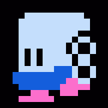
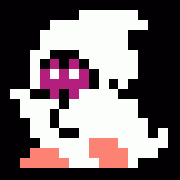
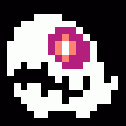
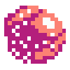
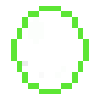
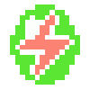
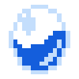
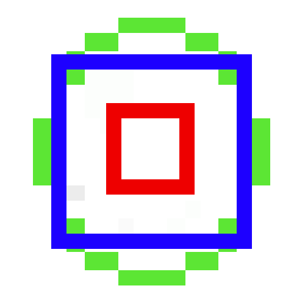
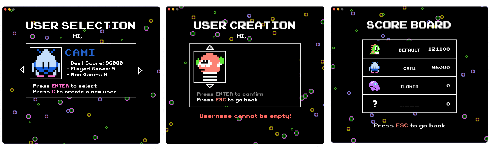

## Bubble Bobble NES in Java

coseksvn

## Java Swing

In questo progetto, abbiamo utilizzato Java Swing per creare l'interfaccia grafica dell'applicazione. Java Swing offre una vasta gamma di componenti per creare interfacce utente intuitive e personalizzabili.

**Componenti Utilizzati**

Per creare una finestra funzionante con Java Swing, abbiamo bisogno di due componenti principali:

* `JFrame`: si occupa della generazione del frame della finestra.
* `JPanel`: si occupa della generazione dell' "immagine" contenuta del frame.

Nel nostro progetto, abbiamo utilizzato solo questi due componenti, poiché non erano necessari altri componenti come `JButton`, `JTextField` o `JTable`.


### JFrame

La classe `GameFrame` estende `JFrame` e si occupa di inizializzare le caratteristiche del frame della finestra. Le operazioni essenziali che effettuiamo sono:
- Impostare il titolo della finestra
- Impostare la dimensione della finestra
- Aggiungere il pannello di gioco
- Impostare la posizione della finestra sullo schermo

Le operazioni "superflue" sono:
- Impostare l'icona della finestra
- Personalizzare la barra dei titoli su macOS

Ecco il codice della classe `GameFrame`:
```java
public class GameFrame extends JFrame {  
  
  public GameFrame(GamePanel gamePanel){  
  
    setTitle("BubbleBobble"); // Set the title of the window  
    setDefaultCloseOperation(JFrame.EXIT_ON_CLOSE); 
    add(gamePanel);  
  
    setResizable(false);  
    pack(); // Adjust the size of the window to fit the preferred size 
    setLocationRelativeTo(null); // Center the window on the screen  

    setGameIcon();  
    macOSTitleBarCustomizations(); 
	
    setVisible(true);  
    createWindowFocusListener(gamePanel);  
  }  
  
  private void createWindowFocusListener(GamePanel gamePanel){  
    addWindowFocusListener(new WindowFocusListener() {  
      @Override  
      public void windowGainedFocus(WindowEvent e) {  
        // empty method (if focus is gained do nothing)  
      }  
  
      @Override  
      public void windowLostFocus(WindowEvent e) {  
        gamePanel.getGameController().windowFocusLost();  
      }  
    });  
  } 
  
  private void setGameIcon(){  
    Image icon = new ImageIcon(GAME_ICON).getImage();  
    setIconImage(icon); // Set the icon of the window  

    // set taskbar icon
    try {  
      Taskbar.getTaskbar().setIconImage(icon);  
    } catch (UnsupportedOperationException e) {  
      System.out.println("TaskBar not supported on Windows!");  
    }  
  }  
  
  private void macOSTitleBarCustomizations() {    
    if (System.getProperty("os.name").toLowerCase().contains("mac")) {  
      getRootPane().putClientProperty("apple.awt.fullWindowContent", true);  
      getRootPane().putClientProperty("apple.awt.transparentTitleBar", true);  
      getRootPane().putClientProperty("apple.awt.windowTitleVisible", false);  
    } else {  
      System.out.println("macOS customizations are not applied as the current OS is not macOS.");  
    }  
  }  
}
```

### JPanel

Il pannello di gioco è un componente fondamentale dell'applicazione. La classe `GamePanel` estende `JPanel` e si occupa di gestire l'interfaccia grafica del gioco.

Il costruttore della classe `GamePanel` accetta un oggetto `GameController` come parametro. Questo oggetto è responsabile della gestione degli eventi, ed in particolare del **gameLoop** per la generazione degli FPS, oltre a questo inizializza gli `InputListener`.

```java
public GamePanel(GameController gameController) {  
    this.gameController = gameController;  
    setBackground(Color.BLACK);  
    setPanelSize();  
  
    // Input Listeners  
    addKeyListener(new KeyBoardInputs(this));  
    addMouseListener(new MouseKeyInputs(this));  
    addMouseMotionListener(new MouseMotionInputs(this));  
}
```

La dimensione del pannello è impostata utilizzando la classe `Dimension`. La larghezza e l'altezza del pannello sono definite dalle costanti `Constants.GAME_WIDTH` e `Constants.GAME_HEIGHT`.

```java
private void setPanelSize() {  
    Dimension size = new Dimension(Constants.GAME_WIDTH, Constants.GAME_HEIGHT);  
    setPreferredSize(size);  
}
```

Il metodo `paintComponent` è responsabile del rendering dell'interfaccia grafica del gioco. Questo metodo è chiamato automaticamente dal sistema di rendering di Java.

```java
public void paintComponent(Graphics g) {  
    Toolkit.getDefaultToolkit().sync();
    super.paintComponent(g);
    
    gameController.render(g);  
}
```

## GameController e GameLoop

Il `GameController` è la prima classe inizializzata di tutto il gioco e da questa a cascata vengono inizializzate tutte le altre. Il suo scopo principale è quello di gestire il gameloop.

Il game loop è il cuore dell'app, responsabile di aggiornare e renderizzare il gioco a una frequenza costante. Per fare ciò, il `GameController` implementa l'interfaccia `Runnable`.

Il `GameController` contiene il metodo `run()` dell'interfaccia `Runnable`, che è chiamato automaticamente quando il gioco è avviato e continua a eseguire fino a quando il gioco non è terminato.

#### Run()

Questo metodo è il game loop vero e proprio e si occupa di chiamare a intervalli costanti i metodi `update()` e `render()`, che si occupano rispettivamente dell'aggiornamento e della renderizzazione di tutte le classi del gioco.

Il gameloop è basato su due concetti principali:

* **UPS (Updates Per Second)**: il numero di volte che il gioco viene aggiornato al secondo.
* **FPS (Frames Per Second)**: il numero di volte che il gioco viene renderizzato al secondo.

Il gameloop utilizza due variabili per tenere traccia del tempo:

* `timePerFrame`: il tempo necessario per renderizzare un frame.
* `timePerUpdate`: il tempo necessario per aggiornare il gioco.

Il gameloop esegue i seguenti passaggi:

1. Calcola il tempo trascorso dall'ultimo frame e dall'ultimo aggiornamento.
2. Aggiorna il gioco se il tempo trascorso dall'ultimo aggiornamento è maggiore o uguale a `timePerUpdate`.
3. Renderizza il gioco se il tempo trascorso dall'ultimo frame è maggiore o uguale a `timePerFrame`.
4. Calcola il numero di frame e aggiornamenti eseguiti al secondo.

Ecco il codice del gameloop:
```java
@Override
public void run() {
    double timePerFrame = 1000000000.0 / Constants.FPS_SET;
    long lastFrameTime = System.currentTimeMillis();
    int frames = 0;
    double deltaF = 0; // Delta Frame

    double timePerUpdate = 1000000000.0 / Constants.UPS_SET;
    long lastUpdateTime = System.nanoTime();
    int updates = 0;
    double deltaU = 0; // Delta Update

    // Game Loop
    while (true) {
        long currentTime = System.nanoTime();

        deltaU += (currentTime - lastUpdateTime) / timePerUpdate;
        deltaF += (currentTime - lastUpdateTime) / timePerFrame;
        lastUpdateTime = currentTime;

        if (deltaU >= 1) {
            update();
            updates++;
            deltaU--;
        }

        if (deltaF >= 1) {
            gamePanel.repaint();
            frames++;
            deltaF--;
        }

        // FPS | UPS Calculation
        if (System.currentTimeMillis() - lastFrameTime >= 1000) {
            lastFrameTime = System.currentTimeMillis();
            System.out.println("FPS: " + frames + " | UPS: " + updates);
            frames = 0;
            updates = 0;
        }
    }
}
```

#### Thread
Dope aver implementato l'interfaccia runnable e il metodo `run()` dobbiamo inserire questa class all'interno di un Thread che è eseguito in modo indipendente dal resto del gioco.

```java
public void startGameLoop() {  
    gameThread = new Thread(this);  
    gameThread.start();  
}
```

## Nemici

Nel gioco originale, i giocatori si trovano ad affrontare una grande varietà di mostri. Tra questi, io ho ricreato due dei nemici che popolano i livelli iniziali del gioco: **ZenChan** e **Maita**. 

Inoltre, ho anche ricreato **SkelMonsta**, un nemico che non appartiene a nessun livello specifico, ma che entra in azione quando un livello sta durando più del previsto.

| Immagine                   | Nome           |
| -------------------------- | -------------- |
|    | **ZenChan**    |
|      | **Maita**      |
|  | **SkelMonsta** |
### ZenChan e Maita

Questi due nemici hanno lo stesso loop di movimento, ma differiscono nella loro tecnica di attacco:
- `ZenChan` può togliere una vita al giocatore semplicemente toccandolo.
- `Maita`, rispetto a `ZenChan`, ha l'abilità di lanciare al giocatore delle palle di fuoco.


#### Loop di movimento

Questi due nemici si muovono camminando sui pavimenti, ma hanno la capacità di saltare tra una piattaforma e l'altra e di volare verso piattaforme più in alto se il giocatore si trova sopra di loro.

Il seguente flowchart rappresenta il flusso di decisioni che vengono prese dai bot per muoversi:


Una delle caratteristiche che mi ha permesso di ricreare in modo fedele il movimento dei nemici è stata quella di non dare accesso alla posizione reale del giocatore in modo costante.

Infatti, ogni **Maita** e **ZenChan** hanno un campo `PlayerPos`, ma questo viene aggiornato con la reale posizione del giocatore in un intervallo di tempo casuale compreso tra 4 e 8 secondi. Ciò rende il movimento dei nemici meno reattivo e più imprevedibile.

#### Modalità Beast

Con modalità Beast si intende quando i nemici cambiano colore in rosso e diventano più "aggressivi", ovvero:
- i nemici si muovono più velocemente
- il tempo di update massimo della posizione del giocatore viene ridotto da 8 a 5 secondi

Questa modalità viene attivata in due casi:
- se è rimasto un solo nemico nel livello
- se si è avviata la modalità **HurryUp**

### HurryUp e SkelMonsta

La modalità HurryUp si attiva quando, per 15 secondi, il giocatore non perde alcuna vita o se non viene eliminato nessun nemico.

Nella modalità HurryUp, tutti i nemici diventano aggressivi ("modalità Beast") e viene spawnato un nuovo nemico, `SkelMonsta`.

**SkelMonsta** è un nemico completamente diverso da **ZenChan** o **Maita**, infatti non cammina sui pavimenti, ma vola per la mappa muovendosi soltanto orizzontalmente o verticalmente. Non è possibile catturarlo o eliminarlo in alcun modo. L'unico modo per farlo despawnare è eliminare tutti gli altri nemici o perdere una vita.

È importante non farsi taccare da `skelmonsta` perché risulterebbe nella perdita di una vita.


## Proiettili

I proiettili sono una tipologia di oggetti, ognuno con le sue abilità, ma che sono tutti accomunati dal fatto che si muovono orizzontalmente sulla mappa e che permettono di eliminare delle entità specifiche.

Di tutti i "proiettili" presenti nel gioco originale, ho deciso di implementare:

| Immagine                        | Nome                          |
| ------------------------------- | ----------------------------- |
|   | **Lightning Projectile**      |
|  | **Maita Fireball Projectile** |
|             | **Player Bubble Projectile**  |

#### Lightning Projectile

Il **Lightning Projectile** è un proiettile generato quando il giocatore fa esplodere una **Lightning Bubble**. Una volta generato, si muoverà orizzontalmente nella stessa direzione che il giocatore aveva quando ha colpito la bolla.

Il proiettile si disattiva quando si interseca con il limite più esterno della mappa o quando colpisce un nemico. Quando il proiettile colpisce un nemico, quest'ultimo viene eliminato.

#### Maita Fire Projectile

Il **Maita Fire Projectile** è un proiettile generato dal mostro `Maita`. Maita, quando ha per tre secondi consecutivi line of sight con il giocatore, lancia una palla di fuoco nella direzione del giocatore. Questo proiettile è disattivato quando colpisce il giocatore o quando è a contatto con un muro. Se il giocatore è colpito, perde una vita.

#### Player Bubble Projectile

Il **Player Bubble Projectile** non è altro che l'attacco del giocatore. Il giocatore, premendo il tasto invio, effettua un attacco che genera una bolla che inizialmente è in uno stato di "proiettile" in cui si muove orizzontalmente e, se colpisce un nemico, lo cattura.

Una volta finita la sua animazione, il proiettile si trasforma in una bolla vera e propria che può essere fatta esplodere dal giocatore.


## Bolle

Come si può evincere dal nome del gioco (Bubble Bobble), una delle meccaniche centrali del gameplay è la presenza di bolle, in particolare ne esistono di due categorie: `playerBubbles` e `specialBubble`.

Le caratteristiche che accomunano tutte le bolle sono:
- Il giocatore ha la capacità di **interagire** in diversi modi con le bolle, spostandole, saltandoci sopra e naturalmente facendole esplodere.
- **Esplosione a catena**: tutte le bolle vicino a una bolla esplosa esploderanno a loro volta.
- Il movimento delle bolle è influenzato dai **venti**, infatti ogni tile della mappa ha un campo di direzione del vento. Questo campo indica alle bolle che si trovano sulla tile in quale direzione muoversi.

#### PlayerBubbles

Le `playerBubbles` non sono altro che le bolle generate dal giocatore stesso e ne esistono di due tipi:

| Immagine                              | Nome             | Caratteristiche                                                                                                                                                                                                                                                               |
| ------------------------------------- | ---------------- | ----------------------------------------------------------------------------------------------------------------------------------------------------------------------------------------------------------------------------------------------------------------------------- |
|        | **Empty Bubble** | È la bolla generata dall'attacco del giocatore ed è utilizzata per catturare i nemici.                                                                                                                                                                                        |
|  | **Enemy Bubble** | Quando una `empty bubble` colpisce un nemico, la bolla lo cattura e si trasforma in un `enemy bubble`. Le `enemy bubble` hanno un timer interno che, quando scade, libera il nemico. Se la bolla viene colpita dal giocatore e fatta esplodere, allora il nemico è eliminato. |

#### SpecialBubbles

Le bolle speciali, a differenza delle `playerBubbles`, non vengono generate da un giocatore, ma spawnano automaticamente. Lo spawn delle bolle è gestito da una classe chiamata Bubble manager, che in base alle caratteristiche del livello decide dove e quali bolle creare.

Nel mio gioco sono presenti due tipi di bolle speciali:

| Immagine                              | Nome                 | Caratteristiche                                                                                             |
| ------------------------------------- | -------------------- | ----------------------------------------------------------------------------------------------------------- |
|  | **Lightning Bubble** | Quando fatte esplodere, generano un `lighting projectile` che può essere utilizzato per eliminare i nemici. |
|        | **Water Bubble**     | Quando fatte esplodere, generano un `water flow`.                                                           |

#### Water Flow

Quando una bolla d'acqua esplode, viene generato un `waterFlow`, un oggetto d'acqua che cattura ed elimina tutti i nemici lungo il suo percorso. Può anche catturare il giocatore che per tutto il percorso del `waterFlow` perderà la capacità di muoversi liberamente.

Una volta che il `waterFlow` raggiunge la base della mappa e cade nel vuoto:
- il giocatore verrà spawnato nella parte alta della mappa;
- per ogni nemico catturato dalla flusso d'acqua, verrà generato un item a forma di cristallo d'acqua del valore di 1000 punti.


### Informazioni aggiuntive

Come detto in precedenza, le bolle si muovono nella mappa seguendo i venti. Ad ogni tile è associata una direzione e le bolle possono controllare in che direzione muoversi semplicemente accedendo a questo campo della tile. Ciò permette di creare livelli con correnti d'aria che spostano le bolle per la mappa, con la possibilità di creare dei punti di accumulazione.

Tuttavia, le bolle non si muovono soltanto in base alle correnti dei venti, ma possono essere influenzate anche da altre bolle e dal giocatore. Infatti:
* Ogni bolla ha un campo di forza che respinge le altre per evitare che si sovrappongano.
* Il giocatore può spostare le bolle senza farle esplodere semplicemente avvicinandosi lentamente.

>[!note] Struttura a doppia hitbox
>
>Le bolle hanno due hitbox: una più grande e una più piccola.
>
>- L'hitbox più grande è la prima che va in contatto con il giocatore e permette di muovere la bolla nella direzione opposta al player.
>- Se il giocatore si muove molto velocemente, allora riuscirà a colpire la hitbox più interna (quella più piccola) attivando l'esplosione della bolla.
>
>

## Punti e Drops

Senza l'utilizzo di abilità speciali, l'unico modo per eliminare i nemici è catturarli in una bolla e poi farla esplodere. Ogni volta che il giocatore fa esplodere una bolla contenente un nemico, si verificano due eventi:

1. Il giocatore guadagna punti.
2. Viene generato un frutto.

La quantità di punti e il tipo di frutto generato dipendono dalla quantità di bolle contenenti nemici che vengono fatte esplodere consecutivamente. Questo meccanismo viene gestito attraverso l'esplosione a catena.

#### Esplosioni a Catena

Questa è una delle meccaniche più interessanti. Infatti, ogni volta che una bolla esplode, provoca automaticamente l'esplosione di tutte le bolle con cui è in contatto. Maggiore è il numero di `EnemyBubbles` fatte esplodere consecutivamente, più alta sarà la ricompensa.

| Bolle Nemiche eliminate consecutivamente | 1                              | 2                               | 3                              | 4                                  | 5                               | 6                                 | 7                               |
| ---------------------------------------- | ------------------------------ | ------------------------------- | ------------------------------ | ---------------------------------- | ------------------------------- | --------------------------------- | ------------------------------- |
| Valore Esplosione                        | 1000                           | 2000                            | 4000                           | 8000                               | 16,000                          | 32,000                            | 64,000                          |
| Alimento                                 |  |  |  |  |  |  |  |
| Valore Alimento                          | 1000                           | 2000                            | 3000                           | 4000                               | 5000                            | 6000                              | 7000                            |


## Power Ups

Nel gioco originale c'è una grande quantità di potenziamenti che possono essere ottenuti completando delle "sfide". 

Queste sono i 10 potenziamenti che ho implementato:

| Immagine             | Nome               | Funzione                                                                                                | Sfida                                                                   | Punti    |
| -------------------- | ------------------ | ------------------------------------------------------------------------------------------------------- | ----------------------------------------------------------------------- | -------- |
|      | **Green Candy**    | Aumenta cadenza di fuoco delle bolle                                                                    | Sparare 35 bolle                                                        | 100      |
|      | **Blue Candy**     | Aumenta velocità di movimento delle bolle                                                               | Far esplodere 35 bolle                                                  | 100      |
|      | **Red Candy**      | Aumenta distanza percorsa dalle bolle                                                                   | Saltare 35 volte                                                        | 100      |
|       | **Shoes**          | Aumenta velocità di movimento del player                                                                | Percorrere una distanza equivalente alla lunghezza delle mappa 15 volte | 100      |
|      | **Orange Parasol** | Salta 3 livelli                                                                                         | Far esplodere 15 bolle d'acqua                                          | 200      |
|  | **Blue Parasol**   | Salta 5 liveli                                                                                          | Far esplodere 20 bolle d'acqua                                          | 200      |
|       | **Chack'n Heart**  | Rende il player invincibile, immobilizza tutti e nemici e li rende eliminabili semplicemente toccandoli | Raccogliere 55 oggetti                                                  | 3000     |
|      | **Emerald Ring**   | 500 punti per ogni salto                                                                                | Raccogliere 3  Green Candy                                              | 1000     |
|      | **Crystal Ring**   | 10 punti per ogni passo                                                                                 | Raccogliere 3 Blue Candy                                                | <br>1000 |
|  | **Ruby Ring**      | 100 per ogni bolla sparata                                                                              | Raccogliere 3 Red Candy                                                 | <br>1000 |

>**Funzionamento:**
>
>All'inizio di ogni livello, precisamente dopo 12 secondi, viene generato in un punto casuale della mappa un nuovo `powerup` tra quelli "disponibili". Per rendere disponibile un potenziamento si deve completare la sfida ad esso associata.
>
>Ogni volta che il player perde una vita, i powerUp ottenuti e i processi delle sfide vengono resettati.

## Livelli

Sono una parte fondamentale del gioco e sono composti da una serie di elementi, tra cui la mappa, le tile, i nemici e le bolle. 

A livello pratico sono oggetti rappresentati da cinque campi specifici: 
- l'immagine della `tileMap`
- un array 2D di interi che rappresenta il tipo e la posizione delle tile
- un array 2D di direzioni utilizzato per ricreare le correnti dei venti
- un generatore di bolle che gestisce la posizione e il tipo di bolle da generare
- una lista di nemici

```java
public class Level {  
  
    private BufferedImage tileMap;
    private int[][] levelTileData;
    private Direction[][] windDirectionData;
    private BubbleGenerator bubbleGenerator;
    private ArrayList<EnemyModel> Enemies;
    
    //methods...
}
```

Come vedremo tutte queste informazioni sono inizialmente estrapolate dalla `tileMap`.

### Tile Map

La mappa di livello è un'immagine composta da 32x38 pixel, dove ognuno rappresenta una tile del livello. 

Le informazioni di ogni tile sono codificate nell'immagine utilizzando i canali RGB dei pixel. 
- Il canale rosso è utilizzato per codificare il tipo di tile
- Il canale verde è utilizzato per codificare il tipo di nemico
- Il canale blu è utilizzato per codificare la direzione dei venti.

Inoltre, il primo pixel in alto a sinistra di ogni livello contiene informazioni riguardanti il `BubbleGenerator` (la classe che si occupa di generare le bolle).

A sinistra abbiamo la `tileMap` a destra il risultato a schermo.

### Tiles

Ogni livello è composto da un campo chiamato `levelTileData`, ovvero un array bidimensionale di interi (32x38) a cui ogni numero è associata una tile. In particolare, all'intero 1 è associata la tile del primo livello, all'intero 2 la tile del secondo livello e cosi via per tutti i restanti livelli.

Questa informazione non viene utilizzata soltanto per disegnare la mappa a schermo, ma anche per calcolare le collisioni delle entità con la mappa. Qualsiasi tile con valore intero compreso tra 1 e 150 è considerata solida.

L'array 2D di interi che rappresenta le tile è "generato" dalla `tileMap` image attraverso il seguente metodo:

```java
static int[][] GetLevelTilesData(BufferedImage img) {  
  
    int levelData[][] = new int[Constants.TILES_IN_HEIGHT][Constants.TILES_IN_WIDTH];  
  
    for(int x = 0; x < img.getHeight(); x++)  
        for (int y = 0; y < img.getWidth(); y++) {  
  
            Color color = new Color(img.getRGB(y, x));  
            int red = color.getRed();  
            if (red >= 150)  
                red = 0;  
  
            levelData[x][y] = red;  
        }  
    return levelData;  
}
```

Questo metodo fa un parsing dell'immagine pixel per pixel, controllando il valore del canale rosso per ottenere l'intero che rappresenta la tile nell'array 2D.

### Direzione dei venti

La classe `level` al suo interno contiene un campo di nome `windDirectionData`, un array bi-dimensionale (32x38) dove ogni elemento rappresenta la direzione del vento della tile associata.

Direction non è altro che un `enum` definita in questo modo:

```java
enum Direction {
	LEFT, RIGHT, UP, DOWN, NONE;
}
```

Questa informazione è utilizzata dalle bolle per capire in che direzione devono muoversi. Attraverso le coordinate `x`, `y` le bolle possono calcolare in che tile della mappa si trovano. Conoscendo questa possono accedere all'array `windDirectionData` e prendere la direzione di movimento dall'array stesso.

L'array 2D di direzioni è "generato" dalla `tileMap` image attraverso il seguente metodo:

```java
static Direction[][] GetWindsDirectionsData(BufferedImage img) {  
  
    Direction[][] windDirectionData = new Constants.Direction[TILES_IN_HEIGHT][TILES_IN_WIDTH];  
  
    for(int x = 0; x < img.getHeight(); x++)  
        for (int y = 0; y < img.getWidth(); y++) {  
  
            Color color = new Color(img.getRGB(y, x));  
            int blue = color.getBlue();  
  
            if (blue >= 100)  
                blue -= 100;  
  
            Direction direction;  
  
            switch (blue) {  
                case 1  -> direction = Direction.LEFT;  
                case 2  -> direction = Direction.RIGHT;  
                case 3  -> direction = Direction.UP;  
                case 4  -> direction = Direction.DOWN;  
                default -> direction = Direction.NONE;  
            }  
  
            windDirectionData[x][y] = direction;  
        }  
  
    return windDirectionData;  
}
```

Utilizziamo il colore blue dei pixel dell'immagine per codificare l'informazione. Se il valore è:
- `0` o `100`: nessun vento
- `1` o `101`: vento verso sinistra
- `2` o `102`: vento verso destra
- `3` o `103`: vento verso l'alto
- `4` o `104`: vento verso il basso

Combinando i venti delle singole tile è possibile creare delle correnti d'aria per gestire i movimenti delle bolle e portarle nei punti di accumulazione.


### Bubble Generator

Ogni livello contiene un oggetto `BubbleGenerator`. Questa classe si occupa della generazione delle bolle speciali, come le `WaterBubble` e le `LightingBubble`.

Le informazioni relative al `BubbleGenerator` di ogni livello sono codificate nel canale verde del primo pixel in alto a sinistra della `tileMap`. Il valore di questo pixel determina il tipo di bolle da genere e la loro posizione:
* 101: verranno generate `WaterBubble` nella parte alta della mappa
* 102: verranno generate `WaterBubble` nella parte bassa della mappa
* 103: verranno generate `LightingBubble` nella parte alta della mappa
* 104: verranno generate `LightingBubble` nella parte bassa della mappa
* qualsiasi altro valore indica che non ci sono generatori di bolle nel livello

Queste informazioni vengono estrapolate dall'immagine `tileMap` attraverso il seguente metodo:

```java
static BubbleGenerator GetBubbleGenerator(BufferedImage img) {  
  
    Color color = new Color(img.getRGB(0, 0));  
    int green = color.getGreen();  
    BubbleGenerator bubbleGenerator;  
  
    switch (green) {  
        case 101 -> bubbleGenerator = new BubbleGenerator(WATER_BUBBLE, TOP);  
        case 102 -> bubbleGenerator = new BubbleGenerator(WATER_BUBBLE, BOTTOM);  
        case 103 -> bubbleGenerator = new BubbleGenerator(LIGHTNING_BUBBLE, TOP);  
        case 104 -> bubbleGenerator = new BubbleGenerator(LIGHTNING_BUBBLE, BOTTOM);  
        default  -> bubbleGenerator = new BubbleGenerator(NONE, NONE);  
    }  
  
    return bubbleGenerator;  
}
```

### Nemici

Ogni livello contiene una lista di nemici che verrà utilizzata dall'`EnemyManager` per la gestione di questi ultimi. La creazione di questa lista avviene in base alle informazioni estrapolate dalla `tileMap` image, dove ogni pixel rappresenta una tile della mappa.

Il canale verde dei valori RGB dei pixel viene utilizzato per indicare la tipologia di nemico che appartiene alla tile associata a quel pixel. 

In particolare, se il canale verde assume i seguenti valori:
- 1 --> su quella tile verrà generato un nemico `ZenChan` con direzione iniziale sinistra.
- 2 --> su quella tile verrà generato un nemico `ZenChan` con direzione iniziale destra.
- 3 --> su quella tile verrà generato un nemico `Maita` con direzione iniziale sinistra.
- 4 --> su quella tile verrà generato un nemico `Maita` con direzione iniziale destra.

Queste informazioni vengono estrapolate dall'immagine attraverso un metodo specifico.

```java
static ArrayList<EnemyModel> GetEnemies(BufferedImage img) {  
  
    ArrayList<EnemyModel> list = new ArrayList<>();  
  
    for(int x = 0; x < img.getHeight(); x++)  
        for (int y = 0; y < img.getWidth(); y++) {  
  
            Color color = new Color(img.getRGB(y, x));  
            int green = color.getGreen();  
  
            switch (green) {  
                case 1 -> list.add(new ZenChanModel(y * TILES_SIZE, x * TILES_SIZE, LEFT));  
                case 2 -> list.add(new ZenChanModel(y * TILES_SIZE, x * TILES_SIZE, RIGHT));  
                case 3 -> list.add(new MaitaModel(y * TILES_SIZE, x * TILES_SIZE, LEFT));  
                case 4 -> list.add(new MaitaModel(y * TILES_SIZE, x * TILES_SIZE, RIGHT));  
            }  
        }  
    return list;  
}
```

## Gestione Utenti

All'avvio del gioco, verrà richiesto di selezionare (o creare) un profilo utente che verrà utilizzato per salvare i progressi effettuati dal giocatore. In particolare, i dati utilizzati sono:
- Numero di partite giocate
- Numero di vittorie
- Informazioni riguardanti l'orario e la data dell'ultima partita giocata

Tutte queste informazioni vengono gestite da una classe `User` che permette di salvare i dati su disco implementando l'interfaccia `Serializable`.

### Salvataggio e Lettura

Nella classe `User` sono presenti due metodi `save()` e `read()` che rispettivamente permettono di salvare su disco i cambiamenti effettuati e di leggere i file utente per trasformarli in un oggetto `User`.

```java
public void save(String fileName) {  
    File directory = new File("res/users-data");  
    if (!directory.exists()) {  
        directory.mkdirs();  
    }  
  
    try {  
        FileOutputStream fos = new FileOutputStream(directory + File.separator + fileName);  
        ObjectOutputStream oos = new ObjectOutputStream(fos);  
  
        oos.writeObject(name);  
        oos.writeObject(profilePictureIndex);  
        oos.writeObject(bestScore);  
        oos.writeObject(playedGames);  
        oos.writeObject(wonGames);  
  
        oos.close();  
        fos.close();  
    } catch (IOException e) {  
        e.printStackTrace();  
    }  
}  
```

```java
public static User read(String fileName) {  
    try {  
        // Apri il file  
        FileInputStream fis = new FileInputStream(fileName);  
        ObjectInputStream ois = new ObjectInputStream(fis);  
  
        // Leggi e Casting  
        String name = (String) ois.readObject();  
        int profilePictureIndex = (int) ois.readObject();  
        int bestScore = (int) ois.readObject();  
        int playedGames = (int) ois.readObject();  
        int wonGames = (int) ois.readObject();  
  
        // Crea l'utente  
        User user = new User(name, profilePictureIndex);  
        user.bestScore = bestScore;  
        user.playedGames = playedGames;  
        user.wonGames = wonGames;  
  
        ois.close();  
  
        return user;  
    }  
    catch (ClassNotFoundException | IOException e) {  
        e.printStackTrace();  
        return null;  
    }  
}
```

### User Manager

La classe `UserManager` è utilizzata per la gestione dell'utente. In particolare, è usata per:

- Leggere tutti i file utente e trasformarli in oggetti `User` grazie all'interfaccia `Serializable`
- Creazione di nuovi utenti
- Selezione di un utente

Questa classe contiene il campo `selectedUser` che contiene l'utente attualmente attivo. `UserManager` è utilizzato dalle altre classi dell'app come interfaccia per accedere all'utente selezionato.



## Audio

L'`AudioManager` è una classe della `view` che si occupa della gestione degli audio, in particolare delle canzoni e degli effetti sonori.

I suoni sono salvati in file di tipo `wav` ed è utilizzata la classe `Clip` per la riproduzione dei suoni. Questi file, essendo particolarmente pesanti, vengono processati soltanto una volta, all'avvio del gioco e poi, ad ogni riproduzione, viene riprodotta la clip dello specifico suono presente in una lista.

### Inizializzazione

Durante l'inizializzazione della classe, chiamiamo il metodo `loadAudios()` che, attraverso la classe `Clip`, converte i file audio in oggetti che possono riprodurre dei suoni.

```java
private void loadAudios() {  
    // Carica le canzoni  
    String[] songNames = {"song-intro-and-playing", "song-playing"};  
    songs = new Clip[songNames.length];  
    
    for (int i = 0; i < songNames.length; i++)  
        songs[i] = GetAudio(songNames[i]);  
  
    // Carica gli effetti sonori  
    String[] soundEffectNames = {"sfx-home", "sfx-jump", ..., "sfx-hurry-up"};  
    soundEffects = new Clip[soundEffectNames.length];  
    
    for (int i = 0; i < soundEffectNames.length; i++)  
        soundEffects[i] = GetAudio(soundEffectNames[i]);  
  
    setSoundEffectVolume();  
}
```

### Canzoni

Nel gioco ci sono due canzoni: **intro-song** e **playing-song**. L'`intro-song` viene riprodotta all'inizio della partita e, alla sua fine, viene automaticamente avviata la `playing-song`. Quest'ultima è ripetuta in loop fino alla fine della partita.

Questi automatismi sono ottenuti attraverso degli `action-listener` che permettono di eseguire del codice specifico quando avviene un determinato evento. In questo caso, quando l'`intro-song` termina, riproduciamo la `playing-song` in loop.

```java
public void playIntroSong() {  
    currentSongID = INTO_AND_PLAYING_SONG;  
    setSongVolume();  
  
    // Crea un listener per riprodurre la playing song dopo la fine dell'intro song  
    LineListener listener = new LineListener() {  
        @Override  
        public void update(LineEvent event) {  
            if (event.getType() == LineEvent.Type.STOP) {  
                songs[currentSongID].removeLineListener(this);  
                playPlayingSong();  
            }  
        }  
    };  
  
    // Aggiunge il listener alla intro song  
    songs[currentSongID].addLineListener(listener);  
  
    // Inizia a riprodurre la intro song  
    songs[currentSongID].setFramePosition(0);
```

### Effetti Sonori

| Suono                   | Descrizione                                     |
| ----------------------- | ----------------------------------------------- |
| `sfx-jump`              | Suono del salto del player                      |
| `sfx-player-death`      | Suono della morte del player                    |
| `sfx-bubble-shoot`      | Suono dell'attacco del player                   |
| `sfx-enemy-bubble-pop`  | Suono della enemy bubble che espode             |
| `sfx-water-flow`        | Suono della bolla d'acqua che esplode            |
| `sfx-lightning`         | Suono della bolla lampo che esplode              |
| `sfx-reward-collected`  | Suono riprodotto quando si raccoglie un reward  |
| `sfx-powerup-collected` | Suono riprodotto quando si raccoglie un powerUp |
| `sfx-hurry-up`          | Suono riprodotto quando inizia l'evento hurryUp |
| `sfx-game-over`         | Suono riprodotto quando si perde la partita     |
| `sfx-game-completed`    | Suono riprodotto quando si vince il gioco       |
| `sfx-home`              | Suono riprodotto quando si avvia l'app          |

Ogni suono ha un id specifico e possiamo riprodurre i suoni attraverso questo metodo:

```java
public void playSoundEffect(int soundEffectID) {  
    soundEffects[soundEffectID].start();  
```

## MVC

Il progetto segue il modello MVC (Model, View e Controller), che permette di non avere dipendenze tra il modello, assicurando che sia al 100% riutilizzabile.

Questa struttura è suddivisa in tre package:

* `Model`: in cui è presente tutta la logica del gioco, come nemici, player, mappe ecc. Il modello rappresenta i dati del gioco e gestisce le regole del gioco.
* `View`: si occupa di rappresentare a schermo i veri elementi del gioco. La view riceve i dati dal modello e li rappresenta in una forma visiva.
* `Controller`: si occupa di interpretare gli input provenienti dall'utente e di comunicare con il modello e la view. Il controller gestisce gli input dell'utente e aggiorna i dati del modello.

Per assicurare l'indipendenza del modello dagli altri due package, quest'ultimo non accede mai ad alcuna informazione o metodo presente al di fuori di sé stesso.

Al contrario, `Controller` e `View` sono completamente dipendenti dal `Model` per il loro funzionamento.

Il modello MVC offre diversi vantaggi, tra cui la separazione della logica del gioco dalla rappresentazione visiva e la riduzione delle dipendenze tra le diverse componenti del progetto. Ciò rende più facile la manutenzione e la modifica del codice e permette di riutilizzare il codice in altri progetti.

#### Difficoltà

Implementare una completa separazione tra model, view e controller non è semplice, specialmente quando abbiamo che il model deve notificare un suo cambio di stato agli altri componenti. Per fare ciò è possibile utilizzare il design pattern **Observer Observable**.

## Design Pattern

I design patter utilizzati in questo progetto sono tre:
- [#Observer/Observable](#Observer/Observable)
- [#Singleton](#Singleton)
- [#Flyweight](#Flyweight)

### Observer/Observable

L'Observer/Observable è un pattern di design comportamentale che consente di notificare gli oggetti interessati quando si verifica un evento specifico. Questo pattern è utile quando si hanno oggetti che devono essere aggiornati in base a cambiamenti in altri oggetti.

È particolarmente utile nel contesto dell'architettura MVC (Model-View-Controller), poiché consente di far comunicare il model con la view e il controller in modo asincrono e senza violare il principio di separazione delle responsabilità.

Il pattern di design Observer/Observable è stato adottato in due situazioni specifiche:

* Tra le classi `PlayingModel` e `PlayingView`
* Tra le classi `HurryUpManagerModel` e `HurryUpManagerView`

#### PlayingModel e PlayingView

In questo caso, `PlayingModel` estende `Observable`, e `PlayingView` implementa `Observer`.

Nel `GameController`, dove tutte e due le classi vengono inizializzate, chiamiamo `playingModel.addObserver(playingView);` per far osservare il `playingModel` dalla `playingView`.

Utilizziamo Observer/Observable per notificare alla `PlayingView` l'avvenimento di un reset per cambio di livello o un reset per restart della partita in `PlayingModel`.

Quando la view viene notificata, anche lei effettuerà un reset pertinente a quello effettuato dal model.

Nota: per reset si intende il cambio di alcuni campi allo stato di default.

Per fare ciò, quando vengono chiamati in `PlayingModel` i metodi `newLevelReset()` o `newGameReset()`, notifichiamo del cambiamento.

Codice di **PlayingModel**:

```java
public void nextLevelReset() {  
    // qui ci sono tutti i reset dei vari campi
  
    // notifica del cambiamento
    newLevelReset = true;  
    newPlayReset = false;  
    setChanged();  
    notifyObservers();  
}

public void newGameReset() {  
    // qui ci sono tutti i reset dei vari campi

    // notifica del cambiamento
    newPlayReset = true;  
    newLevelReset = false;  
    setChanged();  
    notifyObservers();  
}
```

Quando il model notifica la `PlayingView`, viene chiamato il metodo `update` che è implementato dall'interfaccia `Observer`. Questo metodo è stato implementato in modo tale che la view effettui lo stesso tipo di reset effettuato nel model.

Codice di **PlayingView**:

```java
@Override  
public void update(Observable o, Object arg) {  
    PlayingModel playingModel = (PlayingModel) o;  
  
    if (playingModel.isNewGameReset())  
        newGameReset();  
  
    if (playingModel.isNewLevelReset())  
        newLevelReset();  
}
```

#### HurryUpManagerModel e HurryUpManagerView

In questo caso, `HurryUpManagerModel` estende `Observable`, e `HurryUpManagerView` implementa `Observer`.

Nel `GameController`, dove tutte e due le classi vengono inizializzate, chiamiamo `hurryUpManagerModel.addObserver(HurryUpManagerView);` per far osservare il `hurryUpManagerModel` dalla `hurryUpManagerModel`.

Utilizziamo Observer/Observable per notificare alla `HurryUpManagerView` l'avvenimento di un reset in `hurryUpManagerModel`.

Codice di **HurryUpManagerModel**:

```java
public void reset() {  
    startHurryUpTimer = START_HURRY_UP_TIMER;  
    activateSkelMonstaTimer = ACTIVATE_SKEL_MONSTA_TIMER;  
  
    hurryUpActive = false;  
    skelMonsta.activateDespawn();  
  
    // notify observers  
    notifyObservers();  
    setChanged();  
}
```

Codice di **HurryUpManagerView**:

```java
@Override  
public void update(Observable o, Object arg) {  
    reset();  
} 
```

### Singleton

Il Singleton è un pattern creazionale che permette di garantire che una classe abbia solo un'istanza, mentre fornisce un punto di accesso globale a questa istanza.

**Aspetti positivi:** Oltre alla ad assicurare la creazione di una sola istanza della classe; un ulteriore vantaggio del Singleton è che consente l'accesso diretto all'istanza della classe attraverso il metodo `getInstance()` senza la necessità di recuperarla da altre classi che l'hanno creata. Ciò elimina la necessità di passare l'istanza della classe come parametro tra le diverse classi, semplificando la struttura del codice e migliorando la sua manutenzione.

**Aspetti negativi:** Tra gli aspetti negativi c'è il rischio di abusare del metodo `getInstance()`, creando più dipendenze tra classi di quelle di cui abbiamo veramente bisogno. Un altro aspetto negativo è che il metodo `getInstance()` non può avere parametri in input.

#### Utilizzo

Il pattern di design Singleton è stato adottato per tutte quelle classi che richiedono un'istanza unica e devono essere facilmente accessibili in tutto il progetto.

Le classi principali che hanno beneficiato di questo approccio sono:

* Tutti i manager di oggetti presenti nel package model, come ad esempio `BubbleManagerModel`, `EnemyManagerModel`, ecc. Queste classi devono essere instanziate una sola volta e sono utilizzate in diversi punti del progetto, anche nella view. L'utilizzo del metodo `getInstance` consente un accesso facile e efficiente a queste istanze.

Tuttavia, durante l'implementazione, ho incontrato un problema relativo all'utilizzo del `getInstance` su classi che richiedono costruttori con parametri in input. 

Per risolvere questo problema, ho adottato un approccio alternativo, consistente nell'implementare un costruttore senza parametri e successivamente chiamare un altro metodo che inizializza i campi necessari. Ad esempio:

```java
public class LevelTransitionModel {      
    private static LevelTransitionModel instance;  
    private PlayingModel playingModel;  
    // altri campi

    private LevelTransitionModel() {  
        playerModel = PlayerModel.getInstance();  
    }  
  
    public static LevelTransitionModel getInstance() {  
        if (instance == null)  
            instance = new LevelTransitionModel();  
        return instance;  
    }  
  
    public void initPlayingModel(PlayingModel playingModel) {  
        this.playingModel = playingModel;
```

### Flyweight

**Flyweight** è un modello di progettazione strutturale che consente di ridurre il consumo di memoria RAM, condividendo campi ad alto consumo di memoria comuni tra più oggetti.

Un esempio ovvio di questo design pattern sono le bolle. Ogni bolla che creiamo deve essere disegnata a schermo e per far ciò ha bisogno di una sprite (immagini utilizzate per l'animazione). Inoltre, in un livello potrebbero essere presenti contemporaneamente tantissime bolle, e per motivi di prestazioni, le bolle una volta fatte esplodere non vengono cancellate dalla lista, ma semplicemente non vengono più aggiornate o disegnate. La loro cancellazione avviene soltanto a fine livello.

Questo significa che in ogni livello potrebbero contenere anche 1000 bolle, e considerando che la sprite delle bolle ha una dimensione di `10KB`, lo spazio occupato da 1000 bolle sarebbe di circa `10 megabyte`.

Per risolvere questo problema, invece di salvare la sprite in ogni bolla, possiamo inserirla nel `bubbleManagerView` come campo e ogni volta che una bolla deve essere disegnata, possiamo usare un getter in `bubbleManagerView` per accedere all'immagine della bolla. Questo approccio consente di ridurre il consumo di memoria RAM, ma ha anche degli aspetti negativi, come ad esempio un aumento leggermente maggiore dell'utilizzo del processore.

Esempio del draw di una bolla:

```java
public void draw(Graphics g) {  
    g.drawImage(bubblesManagerView.getBubbleSprites()[stateIndex][animationIndex], ...);  
}
```

Il pattern di design Flyweight non viene applicato soltanto per le sprite delle bolle, ma viene utilizzato anche per altri oggetti nel gioco. Ecco un elenco degli oggetti che utilizzano questo pattern:

| Oggetto     | Campi Utilizzati     |
| ----------- | -------------------- |
| Bubbles     | Sprite, Mappa, Venti |
| Enemies     | Sprite, Mappa        |
| Projectiles | Sprite, Mappa        |
| Items       | Sprite, Mappa        |
| Points      | Sprite               |
